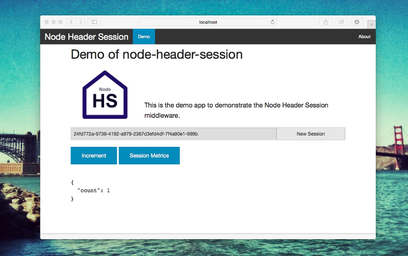

The middleware creates a simple session management via a HTTP header field that contains a token.


# Node Header Session

The middleware creates a simple session management via a HTTP header field that contains a token. This is for a stateless RESTful service.

## Installation

### Setup

	$ cd project/folder
	$ git clone https://github.com/blueskyfish/node-header-session.git
	$ cd node-header-session
	$ npm install

### Test

	$npm test

The tests are written with `mocha` and `chai`

The project is programmed with [VS Code](https://www.visualstudio.com/en-us/products/code-vs.aspx). But you can use any other editor used.


### DefinitelyTyped / tsd

I use the [DefinitelyTyped / tsd](https://github.com/DefinitelyTyped/tsd) for autocomplete the api from external libraries.

	$ npm install -g tsd
	$ tsd install


## Usage

```js
var
	express = require('express'),
	headerSession = require('node-header-session');

var
	app = express();

// register the middleware and the metrics request.
headerSession(app, {
	name: 'x-this-is-a-restful-header-field',
	debug: true,
	metricsUrl: '/metrics/rest-header',
	root: '/restful-services',
	genToken: function () {
		return // generate a unique id / token (may UUID())
	},
	validToken = function (token) {
		return true; // or "/test pattern/.test(token);
	}
	// storage (a session storage engine @see memory-storage.js
});

app.get('/', function (req, res) {
	console.log('token %s', req.headerSession.token);
	req.headerSession.getSession().then(
		function (session) {
			var
				count = session.count || 0;

			session.count = ++count;

			res.send({
				count: count
			});
		}
	);
});

app.listen(3000, function () {
	console.log('server is started...');
});
```

## Options

The middleware will be configured with some options

Name             | Kind     | Description
-----------------|----------|----------------------------------------------
name             | string   | The header name for the session management (**Default** `x-session-token`).
debug            | boolean  | Show debug messages with `console.log` (**Default**: `true`).
root             | string   | **required** The root path for the session handling the the header field.
metricsUrl       | string   | The url für the metrics information. (**Default**: undefined)
genToken         | function | The function for generate the token uuid (**Default**: undefined)
validToken       | function | The function for the validate of the token uuid (**Default**: undefined)
storage          | object   | The storage engine for the session values. The Instance must have the two method **load** and **store**


## Demo

The demo app is in the folder `demo`. Start the demo app with the following commands

	$ cd demo
	$ npm install
	$ npm start

Open the Browser <http://localhost:3000>



*Screenshot from Demo app*


## Storage Engine

The session values can be saved in the memory or in a database table or in a NOSQL engine. If no storage
is defined, then a memory storage will create.


### Storage Interface

    Storage
    + load(token: string): promise
    + store(token: string, session: object): promise
	+ info(): promise  // optional
    + clear(): void    // optional

**Include Storage**

* [MemoryStorage](#memory_storage_class) session values are in the memory cach of the application.
* [FileStorage](file_storage_class) session values are stored in the filesystem.

#### load(token: string): promise

The method `load` try to load the session values from the storage. In case of success
the promise callback returns the session values.

	storage.load(token).then(function (session) {
		// session values
	});

#### store(token: string, values: object): promise

The method `store` try to store the session values into the storage. In case of sucess
the promise callback returns the session values agian.

	storage.store(token, sessionValues).then(function (session) {
		// session values
	});

#### info(): promise

The method `info` try to collect the session information. In case of sucess the promise
callback returns a list of session info. The session info should contains the token,
the creation and modified date.

	storage.info().then(function (sessionInfoList) {
		sessionInfoList.forEach(function (sessionInfo) {
			console.log('%s (%s, %s)', sessionInfo.token,
				sessionInfo.creation, sessionInfo.modified
			);
		});
	}

#### (optional) clear(): void | promise

The method `clear` remove all sessions.

## <a name="memory_storage_class"></a>MemoryStorage

* All sessions are stored in the memory of the application.
* This storage is using only for testing or for the internal development.
* The storage doesn't need to configure.
* If no storage engine is specified when you configure the middleware, the Memory Storage is used automatically.

**Inteface**

	MemoryStorage
	+ load(token: string): promise
	+ store(token: string, values: object): promise
	+ info(): promise;
	+ clear(): void

## <a name="file_storage_class"></a>FileStorage

* All sessions are stored in the file system.
* Before the storage can be used, it must be konfigueriert with the method `init`.

**Configuration**

Property          | Type         | Description
------------------|--------------|----------------------------------------
storagePath       | string       | The directory name for read and write the session values. The directory must be existed!
blacklist         | Array<String>| Optional: Al list with the filenames in the storagePath, that are ignore.

	var
		storeage = require('./lib/file-storage');

	storage.init({
		storagePath: '/tmp/path/for/write/and/read/sessionValues',
		blacklist: ['readme.md', 'config.json']
	});

**Interface**

	FileStorage
	+ load(token: string): promise
	+ store(token, values: object): promise
	+ info(): promise;
	+ appendblackList(blacklist: Array<String>): void;
	+ clear(): promise


## Routemap

* add a timeout for the header session
* **Done** improve the metrics output
* **Done** write tests
* **Done** session values to a storage engine  
  * **Done** *MemoryStorage*
  * **Done** FileStorage
  * and more...
* **Done** *create a own token generator function*
* **Done** *calidation function*

If an important feature is missing or you find an error, please create an Issue  
<https://github.com/blueskyfish/node-header-session/issues>


## Dependencies

See in the file `package.json`


## Third Party Tools

* [NodeJS](https://nodejs.org) or [io.js](https://iojs.org/)
* [ExpressJS](http://expressjs.com/)
* [VS Code](https://www.visualstudio.com/en-us/products/code-vs.aspx)
* [DefinitelyTyped / tsd](https://github.com/DefinitelyTyped/tsd)


## License

	The MIT License (MIT)

	Copyright (c) 2015 BlueSkyFish <blueskyfish@kirchnerei.de>

	Permission is hereby granted, free of charge, to any person obtaining a copy
	of this software and associated documentation files (the "Software"), to deal
	in the Software without restriction, including without limitation the rights
	to use, copy, modify, merge, publish, distribute, sublicense, and/or sell
	copies of the Software, and to permit persons to whom the Software is
	furnished to do so, subject to the following conditions:

	The above copyright notice and this permission notice shall be included in
	all copies or substantial portions of the Software.

	THE SOFTWARE IS PROVIDED "AS IS", WITHOUT WARRANTY OF ANY KIND, EXPRESS OR
	IMPLIED, INCLUDING BUT NOT LIMITED TO THE WARRANTIES OF MERCHANTABILITY,
	FITNESS FOR A PARTICULAR PURPOSE AND NONINFRINGEMENT. IN NO EVENT SHALL THE
	AUTHORS OR COPYRIGHT HOLDERS BE LIABLE FOR ANY CLAIM, DAMAGES OR OTHER
	LIABILITY, WHETHER IN AN ACTION OF CONTRACT, TORT OR OTHERWISE, ARISING FROM,
	OUT OF OR IN CONNECTION WITH THE SOFTWARE OR THE USE OR OTHER DEALINGS IN
	THE SOFTWARE.
